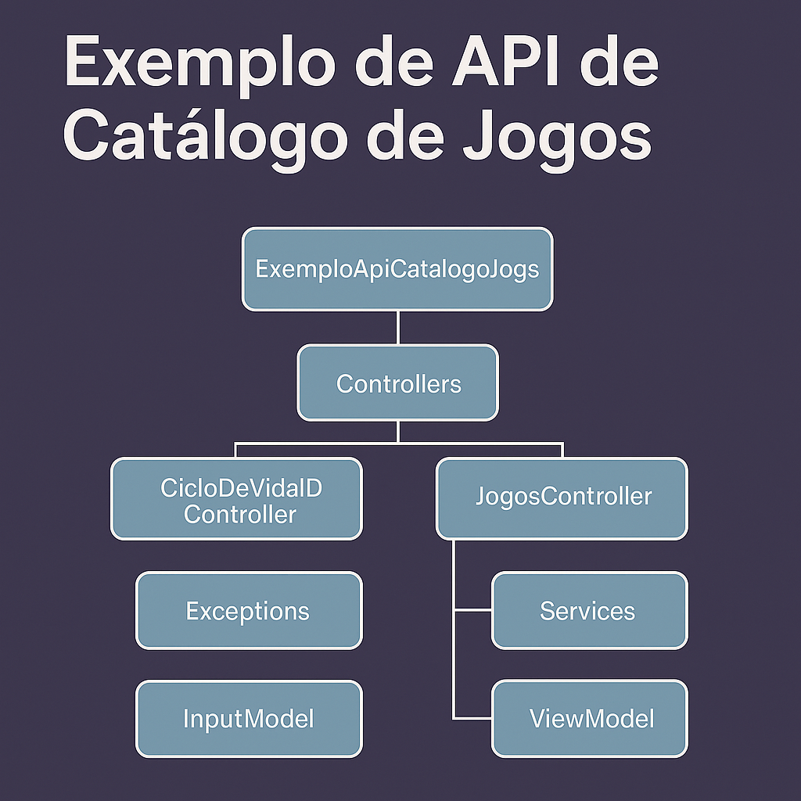

# 🎮 ExemploApiCatalogoJogos

Este projeto é uma API REST desenvolvida em ASP.NET Core para gerenciamento de um catálogo de jogos. A aplicação permite realizar operações de CRUD (Create, Read, Update e Delete) com validações e tratamento de exceções.

## 📂 Estrutura do Projeto

O projeto está estruturado com as seguintes camadas:

- **Controllers**: Responsável por receber as requisições HTTP e chamar os serviços.
- **InputModel / ViewModel**: Usados para encapsular dados de entrada e saída.
- **Services**: Camada que contém a lógica de negócio.
- **Exceptions**: Exceptions customizadas para tratamento de regras de negócio.
- **Interfaces**: Definem os contratos para os serviços e ciclos de vida.
- **Ciclo de Vida de Injeção de Dependência**: Exemplo com Singleton, Scoped e Transient.

## 🧪 Exemplos de Endpoints

### Listar jogos (paginado)

```http
GET /api/v1/jogos?pagina=1&quantidade=5
Obter jogo por ID
http
Copiar
Editar
GET /api/v1/jogos/{idJogo}
Adicionar jogo
http
Copiar
Editar
POST /api/v1/jogos
Content-Type: application/json

{
  "nome": "The Witcher 3",
  "produtora": "CD Projekt",
  "preco": 99.90
}
Atualizar jogo
http
Copiar
Editar
PUT /api/v1/jogos/{idJogo}
Content-Type: application/json

{
  "nome": "The Witcher 3: Edição Definitiva",
  "produtora": "CD Projekt",
  "preco": 129.90
}
Atualizar apenas o preço
http
Copiar
Editar
PATCH /api/v1/jogos/{idJogo}/preco/{novoPreco}
Remover jogo
http
Copiar
Editar
DELETE /api/v1/jogos/{idJogo}
🧬 Ciclo de Vida de Injeção de Dependência
A API também possui um controlador (CicloDeVidaIDController) que demonstra o comportamento das injeções de dependência com os ciclos:

Singleton

Scoped

Transient

A chamada ao endpoint /api/v1/CicloDeVidaID mostra os Guid de instâncias para exemplificar o funcionamento.

🛠️ Tecnologias Utilizadas
.NET Core 3.1

ASP.NET Core Web API

Swagger (para documentação)

Injeção de Dependência

Programação Assíncrona com async/await

📽️ Apresentação
Você pode visualizar uma apresentação explicando a estrutura do projeto aqui.


🚀 Como executar
Clone o repositório:

bash
Copiar
Editar
git clone https://github.com/daniloercosta/ApiCatalogoJogos.git
cd ApiCatalogoJogos
Abra o projeto no Visual Studio ou utilize o terminal:

bash
Copiar
Editar
dotnet run --project ExemploApiCatalogoJogos
Acesse no navegador:

bash
Copiar
Editar
https://localhost:5001/swagger
🧠 Projeto criado para fins didáticos com foco em boas práticas e arquitetura limpa para APIs com .NET Core.
